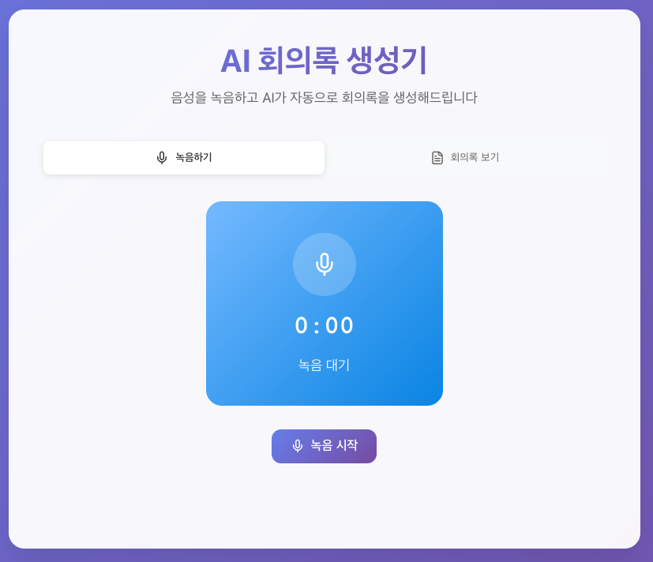
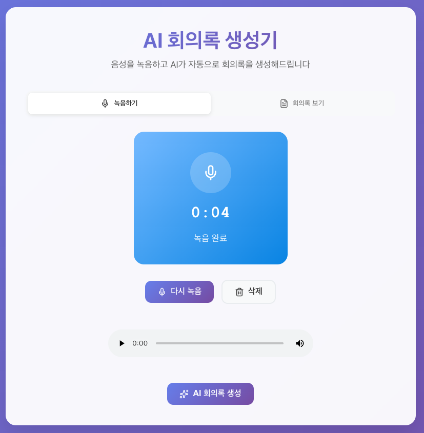
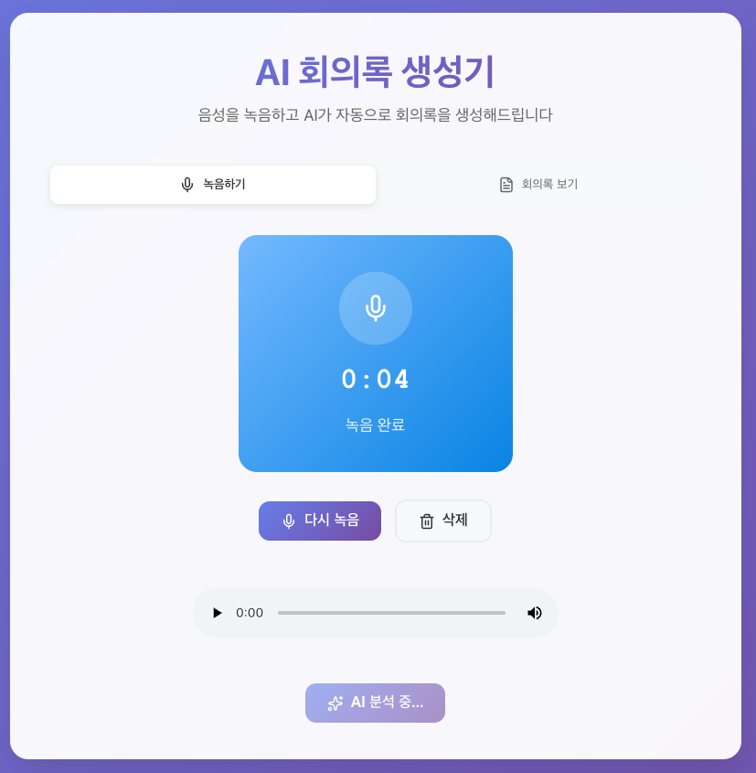
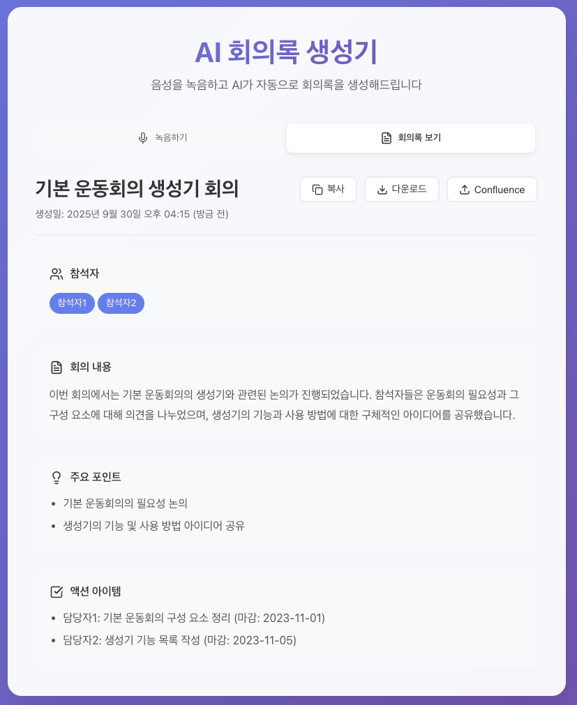
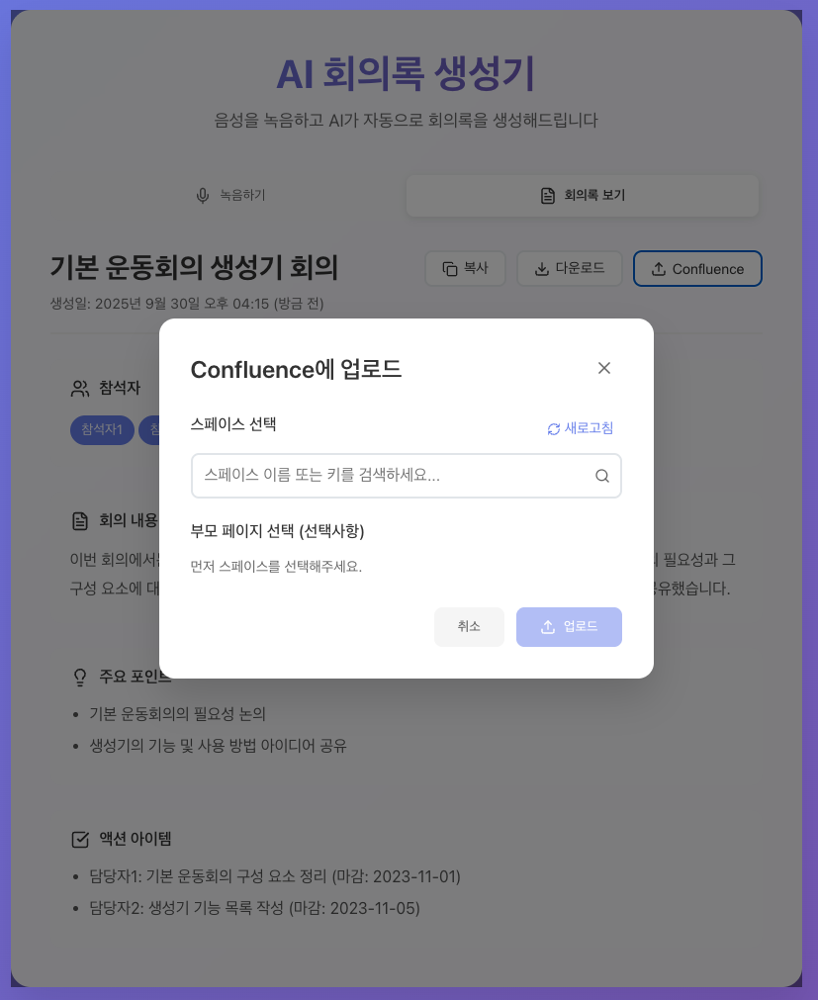

# 🎙️ AI Meeting Transcription & Confluence Integration

AI 기반 회의 녹음 및 자동 회의록 생성 시스템입니다. 실시간 음성 녹음, OpenAI를 통한 회의록 자동 생성, 그리고 Confluence 자동 업로드 기능을 제공합니다.

## 📸 스크린샷

### 1. 최초 화면


_깔끔한 인터페이스로 회의 녹음을 시작할 수 있습니다._

### 2. 녹음 후 화면


_녹음이 완료되면 AI 분석을 시작할 수 있습니다._

### 3. 분석 중 화면


_OpenAI가 음성을 분석하여 회의록을 생성하는 중입니다._

### 4. 작성된 회의록 화면


_구조화된 회의록이 자동으로 생성됩니다. 요약, 참석자, 핵심 포인트, 액션 아이템 등이 포함됩니다._

### 5. Confluence 모달 화면


_생성된 회의록을 Confluence에 직접 업로드할 수 있습니다. 스페이스와 부모 페이지를 트리 구조로 선택 가능합니다._

## 🚀 주요 기능

### 🎯 핵심 기능

- **실시간 음성 녹음**: 브라우저 기반 고품질 음성 녹음
- **AI 회의록 생성**: OpenAI를 활용한 자동 회의록 생성
- **구조화된 출력**: 요약, 참석자, 핵심 포인트, 액션 아이템 자동 분류
- **Confluence 연동**: 생성된 회의록을 Confluence에 직접 업로드
- **계층 구조 지원**: Confluence 페이지 트리 구조 탐색 및 선택

### 🔧 기술적 특징

- **TypeScript**: 전체 프로젝트 타입 안정성 보장
- **React 19**: 최신 React 기능 활용
- **Express.js**: 견고한 백엔드 API 서버
- **OpenAI API**: GPT 모델을 통한 고품질 텍스트 생성
- **Confluence REST API**: 완전한 Confluence 연동
- **Emotion**: CSS-in-JS 스타일링
- **Vite**: 빠른 개발 환경

## 🏗️ 프로젝트 구조

```
record-meeting/
├── asset/                     # 스크린샷 및 에셋
├── backend/                   # Express.js 백엔드
│   ├── src/
│   │   ├── config/           # OpenAI 설정
│   │   ├── middleware/       # 파일 업로드 미들웨어
│   │   ├── routes/          # API 라우트
│   │   │   ├── transcription.ts    # 회의록 생성 API
│   │   │   └── confluence.ts       # Confluence 연동 API
│   │   ├── services/        # 비즈니스 로직
│   │   │   ├── transcriptionService.ts  # OpenAI 연동
│   │   │   └── confluenceService.ts     # Confluence 연동
│   │   └── types/           # TypeScript 타입 정의
│   └── uploads/             # 업로드된 파일 저장소
├── frontend/                 # React 프론트엔드
│   ├── src/
│   │   ├── components/      # React 컴포넌트
│   │   │   ├── AudioRecorder.tsx        # 음성 녹음 컴포넌트
│   │   │   ├── TranscriptViewer.tsx     # 회의록 표시 컴포넌트
│   │   │   ├── ConfluenceUploadModal.tsx # Confluence 업로드 모달
│   │   │   └── PageTree.tsx             # 페이지 트리 컴포넌트
│   │   ├── hooks/           # 커스텀 React 훅
│   │   │   ├── useRecording.ts      # 녹음 기능 훅
│   │   │   ├── useTranscription.ts  # 회의록 생성 훅
│   │   │   └── useConfluence.ts     # Confluence 연동 훅
│   │   └── __tests__/       # 테스트 파일
└── CONFLUENCE_SETUP.md      # Confluence 설정 가이드
```

## 🛠️ 설치 및 실행

### 사전 요구사항

- Node.js 18+
- pnpm (권장) 또는 npm
- OpenAI API 키
- Confluence API 토큰 (선택사항)

### 1. 저장소 클론

```bash
git clone <repository-url>
cd record-meeting
```

### 2. 백엔드 설정

```bash
cd backend
pnpm install

# 환경 변수 설정
cp env.example .env
```

`.env` 파일 설정:

```env
# OpenAI API 설정 (필수)
OPENAI_API_KEY=your_openai_api_key_here

# 서버 설정
PORT=3001
FRONTEND_URL=http://localhost:5173

# Confluence API 설정 (선택사항)
CONFLUENCE_BASE_URL=https://your-domain.atlassian.net
CONFLUENCE_EMAIL=your-email@example.com
CONFLUENCE_API_TOKEN=your_confluence_api_token
CONFLUENCE_SPACE_KEY=YOUR_SPACE_KEY
```

### 3. 프론트엔드 설정

```bash
cd ../frontend
pnpm install

# 환경 변수 설정 (선택사항)
cp env.example .env
```

### 4. 개발 서버 실행

**백엔드 서버:**

```bash
cd backend
pnpm dev
# 서버가 http://localhost:3001에서 실행됩니다
```

**프론트엔드 서버:**

```bash
cd frontend
pnpm dev
# 애플리케이션이 http://localhost:5173에서 실행됩니다
```

### 5. 프로덕션 빌드

```bash
# 백엔드 빌드
cd backend
pnpm build
pnpm start

# 프론트엔드 빌드
cd frontend
pnpm build
pnpm preview
```

## 🔧 API 엔드포인트

### 회의록 생성 API

- `POST /api/transcription/upload` - 오디오 파일 업로드 및 회의록 생성
- `GET /api/transcription/health` - 서비스 상태 확인

### Confluence 연동 API

- `GET /api/confluence/health` - Confluence 연동 상태 확인
- `GET /api/confluence/spaces` - 스페이스 목록 조회
- `GET /api/confluence/spaces/:spaceKey/pages` - 페이지 목록 조회 (계층 구조)
- `POST /api/confluence/upload` - 회의록 Confluence 업로드

## 🎯 사용 방법

### 1. 회의 녹음

1. 메인 화면에서 **"녹음 시작"** 버튼 클릭
2. 브라우저에서 마이크 권한 허용
3. 회의 진행하며 녹음
4. **"녹음 중지"** 버튼으로 녹음 종료

### 2. 회의록 생성

1. 녹음 완료 후 **"AI 분석 시작"** 버튼 클릭
2. OpenAI가 음성을 텍스트로 변환하고 구조화된 회의록 생성
3. 생성된 회의록 확인 및 편집 가능

### 3. Confluence 업로드

1. 회의록 화면에서 **"Confluence"** 버튼 클릭
2. 스페이스 검색 및 선택
3. 부모 페이지 선택 (선택사항) - 트리 구조로 탐색 가능
4. **"업로드"** 버튼으로 Confluence에 페이지 생성

## 🔒 Confluence 연동 설정

Confluence 연동을 위한 자세한 설정 방법은 [CONFLUENCE_SETUP.md](./CONFLUENCE_SETUP.md)를 참조하세요.

### 빠른 설정

1. Atlassian API 토큰 생성: https://id.atlassian.com/manage-profile/security/api-tokens
2. 백엔드 `.env` 파일에 Confluence 정보 추가
3. 서버 재시작 후 연동 테스트

## 🧪 테스트

### 프론트엔드 테스트

```bash
cd frontend
pnpm test          # 테스트 실행
pnpm test:ui       # 테스트 UI 실행
pnpm test:coverage # 커버리지 리포트
```

### 테스트 커버리지

- 핵심 훅 (useRecording, useTranscription, useConfluence)
- 주요 컴포넌트 (AudioRecorder)
- API 연동 로직

## 🛡️ 보안 고려사항

- **API 키 보안**: OpenAI API 키는 서버 환경변수로만 관리
- **CORS 설정**: 프론트엔드 도메인만 허용
- **파일 업로드**: 오디오 파일만 허용, 크기 제한 (50MB)
- **Confluence 인증**: API 토큰 기반 안전한 인증

## 🚀 배포

### Docker 배포 (권장)

```bash
# 전체 스택 배포
docker-compose up -d
```

### 수동 배포

1. 백엔드: PM2 또는 systemd로 프로세스 관리
2. 프론트엔드: Nginx로 정적 파일 서빙
3. 리버스 프록시: Nginx로 API 프록시 설정

**Made with ❤️ for better meeting productivity**
